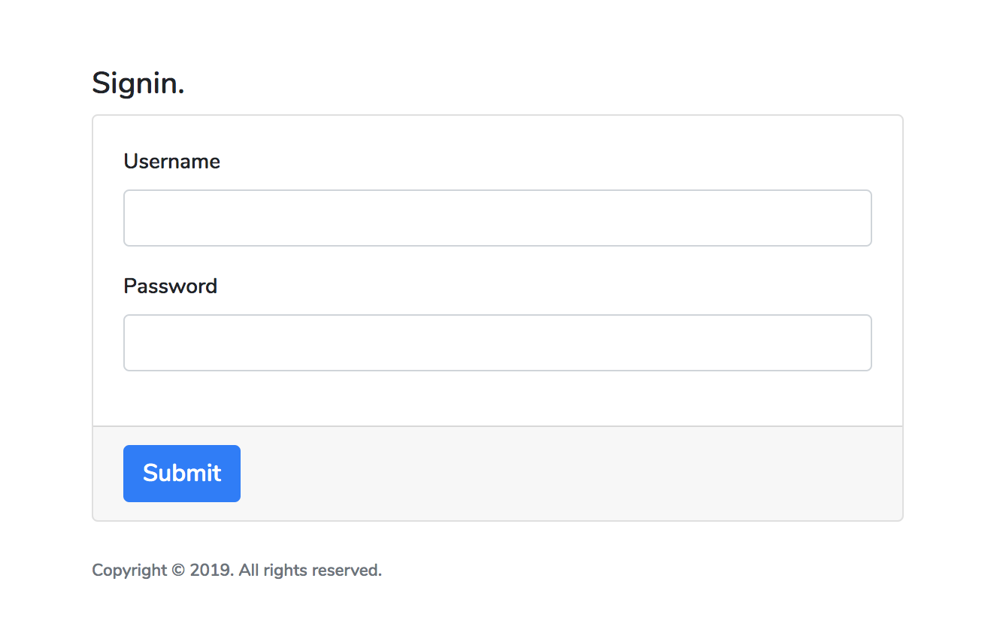
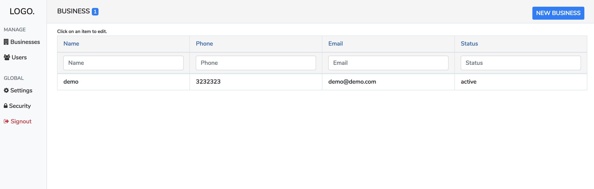

Angular + Bootstrap Free admin theme Startup
-------------------------------------------

- Simple git clone, npm instal and it should be running on http://localhost:8081
- Code have various modules like auth, components, helper, services, etc.

You will need some knowledge of angular to modify and make it work

A sample SQL schema is provider which use this project. You will need to create few api out of schema.

TODO: make a lumen+docker api for this project so it can work-out-of-box.
